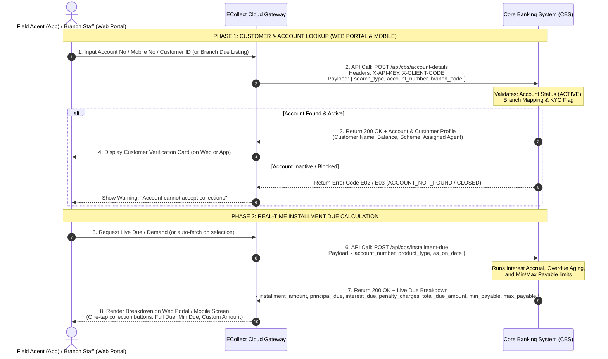
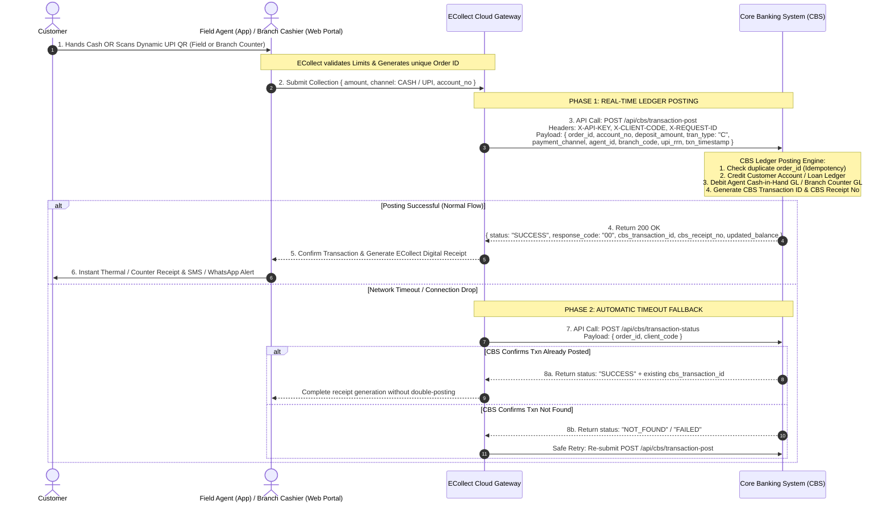

# ECOLLECT - CORE BANKING SYSTEM (CBS) INTEGRATION API SPECIFICATION
**ECollect Private Limited** &mdash; Standard Interface Specification Document for Core Banking Software Vendors

---

## 1. Document Overview & Executive Summary

### 1.1 Purpose
This document provides the standard REST API interface specification for integrating third-party **Core Banking Software (CBS) / Microfinance / Co-operative Banking Systems** with **ECollect Private Limited**'s **ECollect Field Collection & Digital Payment Platform**.

When migrating a client from the **Non-Integrated (Standalone) Model** to the **Integrated Model**, this standard specification enables real-time synchronization of:
- **Branches Master Data**
- **Agents Master Data**
- **Customer Account Details**
- **Live Installment Due & Demand Calculation**
- **Real-Time Transaction Posting (Cash & Dynamic UPI QR Collections)**
- **Transaction Status Re-Query & Reconciliation**

---

### 1.2 Integration Model Comparison

| Feature | Non-Integrated (Standalone Model) | Integrated Model (Core Banking Software) |
| :--- | :--- | :--- |
| **Account Master** | Managed manually or uploaded via Excel | Queried and validated live against CBS |
| **Agent / Branch Data** | Maintained locally in ECollect | Synchronized directly with CBS |
| **Installment Due Info** | Static daily demand list | Real-time live due calculation |
| **Transaction Posting** | Local ledger entry; EOD CSV export | Real-time ledger credit with CBS Receipt No |
| **Payment Modes** | Cash & UPI | Cash & Instant Dynamic UPI QR |
| **WhatsApp Reminders & Links** | 1-Click WhatsApp Due Reminders & Payment Links (Telinfy API & Deep Link) | Automated CBS-linked WhatsApp Reminders & Dynamic QR Payment Links |
| **Customer Receipts** | Digital Receipt via SMS / WhatsApp & Thermal Print | Instant CBS Receipt No via SMS / WhatsApp & Thermal Print |
| **Reconciliation** | Manual Day-End match | Automated API-to-API Day-End summary |

---

### 1.3 End-to-End Workflow Architecture Overview

```
+---------------------------------------------------------------------------------------------------+
|                                 ECOLLECT <---> CBS INTEGRATION ARCHITECTURE                       |
+---------------------------------------------------------------------------------------------------+
|   [ CLIENT CHANNELS ]            [ ECollect Cloud Gateway ]             [ Core Banking System ]   |
|   1. Field Agent Mobile App                   |                                     |             |
|   2. Branch Web Portal (Branch Login)         |                                     |             |
|               |                               |                                     |             |
|   === 1. MASTER SYNC ===                      |                                     |             |
|               |  Pull Branches / Agents       |  POST /api/cbs/branches             |             |
|               |------------------------------>|  POST /api/cbs/agents               |             |
|               |                               |------------------------------------>| (CBS DB)    |
|               |                               |<------------------------------------|             |
|               |                               |                                     |             |
|   === 2. DATA & DUE LISTING (WEB & MOBILE) ===|                                     |             |
|   Branch Web Login: List Branch Accounts/Dues |  POST /api/cbs/account-details      |             |
|   Field Agent App: Search Customer Account    |------------------------------------>| (Validate)  |
|   Display Live Profile, Balance, Scheme       |<------------------------------------|             |
|                                               |                                     |             |
|   Live Due & Demand Calculation               |  POST /api/cbs/installment-due      |             |
|   ------------------------------------------->|------------------------------------>| (Accrual)   |
|   Display Live Principal, Interest, Penalties |<------------------------------------|             |
|                                               |                                     |             |
|   === 3. TRANSACTION POSTING (FIELD & COUNTER)|                                     |             |
|   Field Collection OR Branch Counter Payment  |  POST /api/cbs/transaction-post     |             |
|   (Cash / Dynamic UPI QR)                     |------------------------------------>| (Credit GL) |
|   Print Receipt / SMS / WhatsApp              |<------------------------------------|             |
|                                               |                                     |             |
|   === 4. EXCEPTION / TIMEOUT FALLBACK ===     |  POST /api/cbs/transaction-status   |             |
|   Verify Txn Status if Network Drops          |------------------------------------>| (Check GL)  |
|                                               |<------------------------------------|             |
|                                               |                                     |             |
|   === 5. END-OF-DAY RECONCILIATION ===        |  POST /api/cbs/day-reconciliation   |             |
|   Branch Day-End Audit & Verification         |------------------------------------>| (Reconcile) |
|                                               |<------------------------------------|             |
+---------------------------------------------------------------------------------------------------+
```

> [!NOTE]
> **Unified Access Across Web Portal & Mobile App:**
> Both the **Field Agent Mobile App** and the **Branch Web Portal (Branch Login)** communicate with the Core Banking System through the unified ECollect Cloud Gateway:
> - **Branch Web Portal (Branch Login):** Branch Managers and Cashiers log in via browser to view complete branch account listings, overdue demand lists, monitor field agents, and process branch counter collections.
> - **Field Agent Mobile App:** Field representatives operate on Android/iOS to search accounts, calculate live dues at customer doorsteps, and collect via Cash or Dynamic UPI QR.

---

### 1.4 Workflow Diagram 1: Real-Time Data Fetching & Live Due Calculation

This workflow enables both **Branch Users (logged into the Web Portal)** and **Field Agents (on the Mobile App)** to query customer records on demand and obtain live calculations of current balance, accrued interest, penalty charges, and allowable payment ranges directly from the core banking engine.



#### Step-by-Step API Interaction Table (Data Fetching):

| Step | Initiator | API Call Name | Target System | Purpose & Data Transferred |
| :---: | :--- | :--- | :--- | :--- |
| **1** | Mobile App / Branch Web Portal | `Search / Due Query` | ECollect Gateway | Agent on Mobile or Branch User on Web Portal inputs Account Number (e.g. `LN100200300`) or views Branch Due Listing. |
| **2** | ECollect Gateway | `POST /api/cbs/account-details` | CBS Host | Gateway sends authenticated lookup query to CBS with `account_number` and `branch_code`. |
| **3** | CBS | `Account Details Response` | ECollect Gateway | CBS returns customer identity, scheme type, current balance, opened date, and KYC status. |
| **4** | Mobile App / Branch Web Portal | `Demand Query` | ECollect Gateway | Triggered when agent selects payment or branch user views current collection demand. |
| **5** | ECollect Gateway | `POST /api/cbs/installment-due` | CBS Host | Requests live calculation as of current date (`as_on_date`), passing `product_type`. |
| **6** | CBS | `Live Due Response` | ECollect Gateway | CBS returns exact split: `principal_due`, `interest_due`, `penalty_charges`, `total_due_amount`. |

---

### 1.5 Workflow Diagram 2: Real-Time Transaction Posting & CBS Ledger Credit

This workflow executes when an agent collects cash in the field, a customer scans an instant dynamic UPI QR, or a branch cashier processes a counter collection on the **Branch Web Portal**. It guarantees **instant ledger credit** in CBS, **idempotent posting** (no duplicate entries), and **automatic fallback status verification** if network timeouts occur.



#### Step-by-Step API Interaction Table (Transaction Posting):

| Step | Initiator | API Call Name | Target System | Purpose & Data Transferred |
| :---: | :--- | :--- | :--- | :--- |
| **1** | Mobile App | `Payment Execution` | ECollect Gateway | Agent collects payment (`CASH` or `UPI`). Gateway assigns unique `order_id` (e.g. `ORD202610011450009988`). |
| **2** | ECollect Gateway | `POST /api/cbs/transaction-post` | CBS Host | Primary posting payload sent over mutual whitelisted HTTPS connection with full audit parameters. |
| **3** | CBS | `Ledger Processing` | CBS Internal DB | Credits loan/deposit account, updates interest schedules, debits agent GL, and issues `cbs_receipt_no`. |
| **4** | CBS | `200 OK Response` | ECollect Gateway | Returns `response_code: "00"`, `cbs_transaction_id`, `cbs_receipt_no`, and `updated_balance`. |
| **5** | ECollect Gateway | `POST /api/cbs/transaction-status` *(Fallback)* | CBS Host | **Automated Timeout Safeguard:** If network drops before receiving 200 OK, Gateway checks transaction status before retrying to prevent duplicate debit/credit. |
| **6** | ECollect Gateway | `POST /api/cbs/day-reconciliation` | CBS Host | **EOD Closing:** Compares total daily volume and transaction count between ECollect and CBS ledgers. |

---

## 2. Technical & Security Guidelines

### 2.1 Communication Protocol
- **Transport**: HTTPS (TLS 1.2 or TLS 1.3)
- **Data Exchange**: JSON (`Content-Type: application/json; charset=utf-8`)
- **Network Security**: Mutual Static IP Whitelisting between ECollect Gateway and CBS Host.
- **Authentication**: API Key / Bearer Token transmitted in HTTP Headers.

### 2.2 Standard Request Headers
```http
Content-Type: application/json
Accept: application/json
X-API-KEY: {{CBS_MERCHANT_API_KEY}}
X-CLIENT-CODE: {{SOCIETY_OR_BANK_CODE}}
X-REQUEST-ID: REQ202609231450001234
```

### 2.3 Standard Response Format
All responses must adhere to the standard envelope structure:
```json
{
  "status": "SUCCESS",
  "response_code": "00",
  "message": "Operation completed successfully",
  "timestamp": "2026-09-23T14:50:00Z",
  "data": { }
}
```

---

## 3. Product Codes Supported

| Product Code | Product Description | Typical Collection Frequency |
| :--- | :--- | :--- |
| `LOAN` | Term Loan, Personal Loan, Gold Loan, Vehicle Loan, Business Loan | Daily / Weekly / Monthly |
| `RD` | Recurring Deposit (RD) | Daily / Monthly |
| `DD` / `PIGMY` | Daily Deposit / Pigmy Scheme | Daily |
| `SB` | Savings Bank Account Deposit | Daily / On-Demand |
| `CHIT` / `MFI` | Chit Fund / Microfinance Group Installment | Weekly / Monthly |

---

## 4. API Endpoints Specification

---

### 4.1 Branch Master API
- **Endpoint**: `POST /api/cbs/branches` *(or `GET /api/cbs/branches`)*
- **Purpose**: Fetch all active branches belonging to the institution.

#### Request Body:
```json
{
  "client_code": "FIN001",
  "status": "ACTIVE"
}
```

#### Success Response (`200 OK`):
```json
{
  "status": "SUCCESS",
  "response_code": "00",
  "message": "Branches fetched successfully",
  "data": [
    {
      "branch_code": "BR001",
      "branch_name": "Main Branch - Calicut",
      "ifsc_code": "FINW0000001",
      "contact_number": "04952700001",
      "address": "1st Floor, Financial Towers, Calicut, Kerala",
      "is_active": true
    },
    {
      "branch_code": "BR002",
      "branch_name": "Kochi Branch",
      "ifsc_code": "FINW0000002",
      "contact_number": "04842700002",
      "address": "MG Road, Kochi, Kerala",
      "is_active": true
    }
  ]
}
```

---

### 4.2 Agent Master API
- **Endpoint**: `POST /api/cbs/agents` *(or `GET /api/cbs/agents`)*
- **Purpose**: Synchronize field collection agents, assigned branch, CBS Agent Origin ID, and daily cash collection limits.

#### Request Body:
```json
{
  "client_code": "FIN001",
  "branch_code": "ALL",
  "status": "ACTIVE"
}
```

#### Success Response (`200 OK`):
```json
{
  "status": "SUCCESS",
  "response_code": "00",
  "message": "Agents list fetched successfully",
  "data": [
    {
      "agent_code": "AGT101",
      "agent_origin_id": "CBS_AGT_101",
      "agent_name": "Rahul Das",
      "mobile_number": "9876543210",
      "email": "rahul.das@bank.com",
      "branch_code": "BR001",
      "branch_name": "Main Branch - Calicut",
      "daily_cash_limit": 200000.00,
      "is_active": true
    }
  ]
}
```

> [!IMPORTANT]
> **Agent Code Uniqueness & Validation Rules:**
> - `agent_code` **must be unique within the client institution (`client_code`)**. ECollect verifies uniqueness on a per-institution/merchant basis. Two different banks/societies may use identical codes (e.g., `001`), but within a single institution, every agent must have a distinct `agent_code`.
> - `agent_origin_id`: CBS Primary internal Agent ID or Employee Code.
> - `branch_code`: Must match an active branch code in the Branch Master API.
> - `daily_cash_limit`: Permissible daily cash collection ceiling (in INR). Transactions will be restricted if the agent's cash holding exceeds this threshold.

---

### 4.3 Customer & Account Details API
- **Endpoint**: `POST /api/cbs/account-details`
- **Purpose**: Search customer account live by Account Number, Mobile Number, or Customer ID.

#### Request Body:
```json
{
  "search_type": "ACCOUNT_NO",
  "account_number": "LN100200300",
  "mobile_number": "",
  "product_type": "LOAN",
  "branch_code": "BR001"
}
```

#### Success Response (`200 OK`):
```json
{
  "status": "SUCCESS",
  "response_code": "00",
  "message": "Account details found",
  "data": {
    "account_number": "LN100200300",
    "customer_id": "CUST9001",
    "customer_name": "Suresh Kumar K",
    "mobile_number": "9847000000",
    "email": "suresh@example.com",
    "address": "House 12B, Green Hills, Calicut",
    "product_type": "LOAN",
    "scheme_name": "Personal Gold Loan Scheme 2026",
    "branch_code": "BR001",
    "assigned_agent_code": "AGT101",
    "sanction_amount": 100000.00,
    "sanctioned_amount": 100000.00,
    "interest_rate": 12.50,
    "opened_date": "2025-10-15",
    "current_balance": 45000.00,
    "emi_amount": 5000.00,
    "emi_frequency": "Monthly",
    "last_paid_date": "2026-08-15",
    "last_paid_amount": 5000.00,
    "account_status": "ACTIVE"
  }
}
```

> **Loan Details Key Fields:**
> - `sanction_amount` / `sanctioned_amount`: Total loan principal sanctioned by the bank/society (e.g. `100000.00`).
> - `interest_rate`: Applicable annual interest rate in % per annum (e.g. `12.50`).
> - `opened_date`: Loan account opening / disbursement date in `YYYY-MM-DD` format (e.g. `"2025-10-15"`).

---

### 4.4 Real-Time Due & Demand Details API
- **Endpoint**: `POST /api/cbs/due-details`
- **Purpose**: Calculate live installment dues, overdue principal, interest breakdown, and penalty charges as on date.

#### Request Body:
```json
{
  "account_number": "LN100200300",
  "product_type": "LOAN",
  "as_on_date": "2026-09-23"
}
```

#### Success Response (`200 OK`):
```json
{
  "status": "SUCCESS",
  "response_code": "00",
  "message": "Due details calculated successfully",
  "data": {
    "account_number": "LN100200300",
    "customer_name": "Suresh Kumar K",
    "product_type": "LOAN",
    "sanction_amount": 100000.00,
    "interest_rate": 12.50,
    "opened_date": "2025-10-15",
    "installment_amount": 5000.00,
    "principal_due": 3800.00,
    "interest_due": 1200.00,
    "overdue_principal": 5000.00,
    "penalty_charges": 150.00,
    "other_charges": 0.00,
    "total_due_amount": 10150.00,
    "min_payable_amount": 500.00,
    "max_payable_amount": 45000.00,
    "days_past_due": 38,
    "next_due_date": "2026-10-05"
  }
}
```

---

### 4.5 Real-Time Transaction Posting API
- **Endpoint**: `POST /api/cbs/transaction-post`
- **Purpose**: Post live collection transaction into CBS ledger immediately (supports Cash Collection and Instant Dynamic UPI QR Payments).

#### Request Body:
```json
{
  "order_id": "ORD202609231450009988",
  "account_no": "LN100200300",
  "product_type": "LOAN",
  "deposit_amount": 5150.00,
  "tran_type": "C",
  "payment_channel": "CASH",
  "agent_id": "AGT101",
  "agent_origin_id": "CBS_AGT_101",
  "branch_code": "BR001",
  "payment_reference": "NA",
  "upi_rrn": "",
  "particular": "ECollect Cash Payment - Suresh Kumar",
  "txn_timestamp": "2026-09-23T14:50:35Z",
  "geo_location": {
    "latitude": 11.2588,
    "longitude": 75.7804
  }
}
```

> **Mode Details:**
> - **Cash Collection**: `tran_type: "C"`, `payment_channel: "CASH"`, `upi_rrn: ""`
> - **UPI QR Collection**: `tran_type: "T"`, `payment_channel: "UPI"`, `payment_reference: "PG_TXN_9988123"`, `upi_rrn: "626612345678"`

#### Success Response (`200 OK`):
```json
{
  "status": "SUCCESS",
  "response_code": "00",
  "message": "Transaction posted successfully in CBS ledger",
  "data": {
    "order_id": "ORD202609231450009988",
    "cbs_transaction_id": "CBS_TXN_8849201",
    "receipt_no": "REC-2026-09-00124",
    "account_number": "LN100200300",
    "posted_amount": 5150.00,
    "principal_adjusted": 3800.00,
    "interest_adjusted": 1200.00,
    "penalty_adjusted": 150.00,
    "remaining_outstanding": 39850.00,
    "remaining_due_amount": 5000.00,
    "posting_timestamp": "2026-09-23T14:50:36Z"
  }
}
```

---

### 4.6 Transaction Status Enquiry / Re-Query API
- **Endpoint**: `POST /api/cbs/transaction-status`
- **Purpose**: Verify status of a transaction during network interruptions, timeouts, or recon checks.

#### Request Body:
```json
{
  "order_id": "ORD202609231450009988",
  "account_no": "LN100200300",
  "cbs_transaction_id": "CBS_TXN_8849201"
}
```

#### Success Response (`200 OK`):
```json
{
  "status": "SUCCESS",
  "response_code": "00",
  "message": "Transaction verified",
  "data": {
    "order_id": "ORD202609231450009988",
    "cbs_transaction_id": "CBS_TXN_8849201",
    "receipt_no": "REC-2026-09-00124",
    "account_number": "LN100200300",
    "amount": 5150.00,
    "cbs_status": "POSTED",
    "posting_timestamp": "2026-09-23T14:50:36Z"
  }
}
```

---

### 4.7 Day-End Reconciliation Summary API
- **Endpoint**: `POST /api/cbs/reconciliation`
- **Purpose**: Automate daily collection reconciliation between ECollect and CBS before EOD closing.

#### Request Body:
```json
{
  "collection_date": "2026-09-23",
  "branch_code": "BR001",
  "agent_code": "AGT101",
  "total_cash_count": 25,
  "total_cash_amount": 125000.00,
  "total_upi_count": 14,
  "total_upi_amount": 68500.00,
  "grand_total_amount": 193500.00
}
```

#### Success Response (`200 OK`):
```json
{
  "status": "SUCCESS",
  "response_code": "00",
  "message": "Reconciliation matched successfully with CBS Day Ledger",
  "data": {
    "is_matched": true,
    "cbs_total_amount": 193500.00,
    "difference": 0.00,
    "day_closed_status": "READY_TO_CLOSE"
  }
}
```

---

### 4.8 Transaction Reversal / Cancellation API (Optional)
- **Endpoint**: `POST /api/cbs/transaction-reverse`
- **Purpose**: Cancel or reverse an erroneous collection posting (subject to CBS supervisor approval or within same-day EOD cutoff).

#### Request Body:
```json
{
  "order_id": "ORD202609231450009988",
  "cbs_transaction_id": "CBS_TXN_8849201",
  "account_no": "LN100200300",
  "reverse_amount": 5150.00,
  "reason": "Agent entered wrong cash amount; customer corrected",
  "supervisor_id": "SUP001",
  "supervisor_auth_code": "AUTH998822"
}
```

#### Success Response (`200 OK`):
```json
{
  "status": "SUCCESS",
  "response_code": "00",
  "message": "Transaction reversed successfully in CBS ledger",
  "data": {
    "original_cbs_txn_id": "CBS_TXN_8849201",
    "reversal_cbs_txn_id": "CBS_REV_1122334",
    "reversed_amount": 5150.00,
    "reversed_timestamp": "2026-09-23T15:10:00Z"
  }
}
```

---

## 5. Standard Error Codes Matrix

| HTTP Status | Error Code | Error Constant | Explanation / Resolution |
| :--- | :--- | :--- | :--- |
| `400 Bad Request` | `E01` | `INVALID_PAYLOAD` | Missing mandatory fields or malformed JSON syntax. |
| `404 Not Found` | `E02` | `ACCOUNT_NOT_FOUND` | Account number does not exist in CBS. |
| `400 Bad Request` | `E03` | `ACCOUNT_CLOSED_OR_DORMANT` | Account is closed, dormant, or blocked from collections. |
| `400 Bad Request` | `E04` | `INVALID_AGENT` | Agent ID inactive or not mapped to branch in CBS. |
| `400 Bad Request` | `E05` | `LIMIT_EXCEEDED` | Collection amount exceeds permissible limits. |
| `409 Conflict` | `E06` | `DUPLICATE_ORDER_ID` | `order_id` has already been processed in CBS. |
| `503 Service Unavail` | `E07` | `CBS_EOD_IN_PROGRESS` | CBS Day-End Process (EOD/BOD) running; posting suspended. |
| `400 Bad Request` | `E08` | `REVERSAL_NOT_PERMITTED` | Transaction already closed in EOD or supervisor approval missing. |
| `500 Internal Error` | `E99` | `CBS_INTERNAL_ERROR` | Unhandled error in CBS database or ledger processing. |

---

## 6. CBS Vendor Deliverables & Onboarding Checklist

To complete integration for the client:
- [ ] **Provide Gateway Base URLs**:
  - Sandbox / UAT: `https://uat-cbs.clientbank.com/api`
  - Production: `https://cbs.clientbank.com/api`
- [ ] **Provide API Credentials**:
  - API Key / Secret / Client Code
- [ ] **IP Whitelisting**:
  - ECollect Cloud Server Static IPs whitelisted on CBS firewall.
- [ ] **Provide 3 Test Accounts** for each product type (`LOAN`, `RD`, `DD`, `SB`).
- [ ] **Execute End-to-End Test Postings** for both Cash and UPI collection modes.

---

*© 2026 **ECollect Private Limited**. All rights reserved. Confidential & Proprietary Document.*
